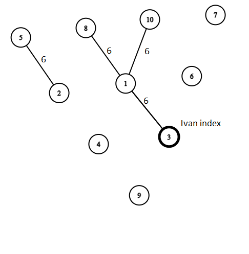

# Task 2. SDA Exam (Easy)

[HackerRank link](<https://www.hackerrank.com/contests/exam-2022-part1-sda/challenges/sda-exam>)

## Statement:

Иванчо има присъствен изпит по СДА. В днешно време трябва да спазваме дистанция и затова студентите са разположени на точно 6 метра от най-близките до тях, на 12 от следващите по близост и т.н. Иванчо иска да предаде бележка с отговорите под формата на ракетка до всички студенти, като това трябва да се случи по възможно най-краткия път. Намерете най-кратките пътища, които ще измине бележката от Иванчо до всеки един от студентите. Даден ученик може да подаде бележката само на хора, които се намират на 6 метра от него и са му приятели.

**Input Format**

На първия ред на стандартният вход се въвежда цяло число $Q$ - брой заявки. Следват $Q$ на брой реда, които имат следният формат:

На първия ред са зададени две числа $N$ - брой студенти, които са се явили на изпита, с индекси $1$ от  до $N$ включително, и $M$ - броят на двойките студенти, които могат да си подават ракетката успешно.

Следват $M$ реда, всеки с по две цели числа $x$ и $y$ - индексите на двойките студенти, които могат да си подават ракетката успешно.

Последният ред съдържа едно цяло число $i$ - индексът на Иванчо.

**Constraints**

$1\le Q\le 10$

$2\le N\le 1000$

$1\le x,y,i\le N$

**Output Format**

Изведете $Q$ на брой реда, като за всяка заявка на един ред, разделени с интервал, отпечатайте $N-1$ числа - най-краткият път, който може да измине ракетката от Иванчо до всеки един студент. Ако няма път се извежда `-1`. 

**ЗАБЕЛЕЖКА:** Най-краткият път от Иванчо до Иванчо не се извежда на изхода!

---

**Sample Input 0**

```
1
10 5
3 1
10 1
3 1
1 8
5 2
3
```

**Sample Output 0**

```
6 -1 -1 -1 -1 -1 12 -1 12
```

**Explanation 0**



Имаме една заявка и 10 ученици с индекси от 1 до 10 в стаята за изпит. 5 от двойнки ученици, които са на разстояние 6, са приятели. Следват 5 реда с двойки числа - индексите на учениците. Индексът на Иванчо е 3. От Иванчо единствено има пътища до ученици с индекс 1, 8 и 10 и съответно с дължини 6, 12, 12. Ракетката няма да стигне до другите ученици.