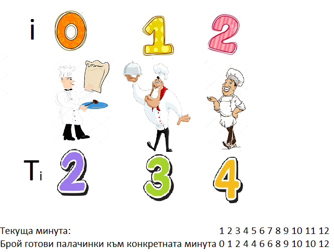

# Task 2. Puncakes (Medium)

[HackerRank link](<https://www.hackerrank.com/contests/exam-2022-part2-sda/challenges/puncakes>)

## Statement:

На палачинков фестивал участват $K$ на брой готвачи, които имат поръчка да приготвят общо $N$ на брой палачинки. Да се намери минималното време, което ще отнеме на готвачите да изпълнят поръчката ако работят едновременно по нея. Всеки готвач е обозначен с различен индекс $i$ и му е необходимо време $T_i$, за да приготви една палачинка.

**Input Format**

От първия ред се въвеждат 2 числа: $N$ - броят на поръчаните палачинки и $K$ - броя на готвачите. На вторият ред се въвеждат $K$ на брой числа, всяко число съответства на времето $T_i$, което е необходимо на $i$-тия готвач да приготви 1 палачинка.

**Constraints**

$1\le N\le 10^{13}$

$1\le K\le10^5$

$1\le i\le K$

$1\le T_i\le 10^4$

**Output Format**

Изведете минималното време, което ще отнеме на готвачите да изпълнят поръчката.

---

**Sample Input 0**

```
3 2
3 5
```

**Sample Output 0**

```
6
```

**Explanation 0**

Поръчката изисква 3 на брой палачинки. Двама готвачи ще изпълняват поръчката. На готвач с индекс 0 са му нужни 3 минути, за да приготви 1 палачинка, а на готвач с индекс 1 са му необходими 5 минути.

---

**Sample Input 1**

```
11 3
2 3 4
```

**Sample Output 1**

```
12
```

**Explanation 1**

Ще разпишем всяка минута какво точно се случва в конкретния пример.



Готвач с индекс $0$ приготвя първата палачинка след минута номер две. След като изчете $4$-тата минута готовите палачинки стават общо $4$. Едната, която е готова от минута номер $2$ и същият готвач вече е направил втора палачинка, тъй като на него му отнема по $2$ минути на палачинка, което означава, че на всеки $2$ минути ще прави по една палачинка. Готвач с индекс $1$ е направил преди минута една и готвач с индекс $4$ тъкмо е станала готова неговата.