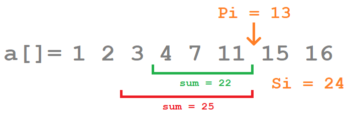

# Task 4. Weird Queries (Hard)

[HackerRank link](<https://www.hackerrank.com/contests/sda-hw-3/challenges/queries-5>)

## Statement:

Дадена ви е редица от $N$ цели числа: $a_1, a_2, \dots, a_N$. Вие трябва да отговорите на $Q$ на брой заявки от вида:

По дадени две цели числа $S_i$ и $P_i$ намерете броя на числата в подредицата $a_{i_1},a_{i_2},\dots,a_{i_K}$, за която е в сила:

- $\sum a_{i_j} \le S_i$
- $a_{i_1}\le a_{i_2}\le\dots\le a_{i_K}\le P_i$
- $\forall a_j \in \\{a_1, a_2,\dots,a_N\\} : a_{i_1} \le a_j \Rightarrow P_i \le a_j \lor a_j \in \\{a_{i_1}, a_{i_2},\dots,a_{i_K}\\}$

По-просто казано, ако всеки път избирате най-голямото непревишаващо $P_i$ число, докато сумата на избраните числа не превишава $S_i$, и спрете да взимате числа, ако не можете да изберете поредното най-голямо, колко числа ще изберете?



**Input format**

Първият ред на стандартния вход съдържа две числа $N$ и $Q$ - броя на елементите в редицата и броя заявки.

Следващият ред съдържа $N$ на брой цели числа $a_i$ - елементите на редицата.

Следващите $Q$ на брой реда съдържат по две цели числа $S_i$ и $P_i$ - числата от заявката.

**Constraints**

$0\le N, Q\le 2\cdot10^5$

$0\le a_i, P_i\le2\cdot10^5$

$0\le S_i\le 10^9$

**Output format**

Изведете $Q$ на брой отделни реда с по едно число - отговора на поредната заявка.

---

**Sample Input 0**

```
7 5
70 10 130 50 40 20 40
150 100
140 50
190 130
60 80
300 60
```

**Sample Output 0**

```
2
3
1
0
5
```

**Explanation 0**

Отговорите се получават чрез избиране на следните числа:

- $|\\{70,50\\}| = 2$
- $|\\{50,40,40\\}| = 3$
- $|\\{130\\}| = 1$
- $|\\{\\}| = 0$
- $|\\{10,50,40,20,40\\}| = 5$