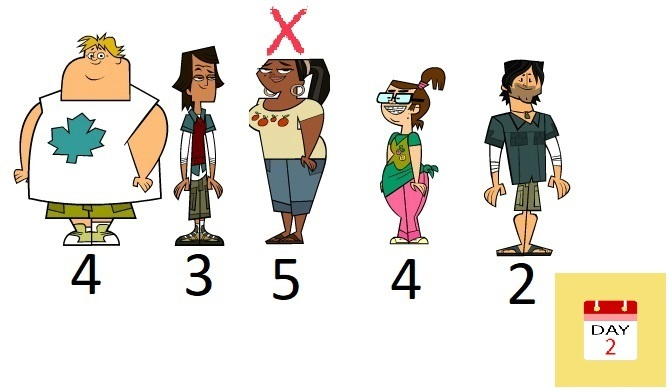

# Task 4. Игри на волята (Hard)

[HackerRank link](<https://www.hackerrank.com/contests/sda-hw-5/challenges/challenge-3105>)

## Statement:

Във ФМИ тази година се провеждат игри на волята, като правилата са малко по-различни. Има само едно племе и всеки ден има елиминационни битки. За всеки участник има число, което отговаря на това колко е гладен. Най-важният критерий за битките е глада и затова винаги губят тези участници, които са по-гладни. Всеки ден участниците имат имунитет в определена ситуация. Даден участник губи битка само ако участникът от ляво на него е по-малко гладен. Всеки участник има имунитет спрямо десния участник. Играчът на позиция 0 със сигурност ще играе финал, тъй като няма и няма да има участници, които да стоят от негово ляво (познава се с водещия и са го уредили). Интересното в това издание на предаването е, че с увеличаването на дните гладът на участниците не се променя.

**Input Format**

На първия ред на стандартния вход ви е дадено положително число $N$ (брой участници). На втория ред са дадени $N$ на брой цели числа - за всеки участник се въвежда по едно число, което отговаря на това колко е гладен.

**Constraints**

$1\le N\le 10^5$

$0\le Arr[i]\le 10^9$

**Output format**

На първия и единствен ред на стандартния изход трябва да изведете едно число - брой дни до финала на предаването. Финалът се настъпва, когато няма учасници, които могат да отпаднат в битка.

---

**Sample Input 0**

```
7
4 3 7 5 6 4 2 
```

**Sample Output 0**

```
3
```

**Explanation 0**


Първият ден отпадат двама участници, единият е учасник с точки на гладуване 7 и той отпада от участник с точки 3 (3<7), а другият отпаднал участник е с точки 6 (6>5).



Вторият ден отпада един участник (5>3).


Третият ден отпада един участник, този, който има точки на гладуване 4 и се намира на предпоследна позиция (4>3).


Вече няма учасници, които могат да отпаднат (4>3>2), което означава, че това е финалът!

---

**Sample Input 1**

```
5
2 6 5 4 3 
```

**Sample Output 1**

```
4
```

**Explanation 1**

Започваме с `2 6 5 4 3` 

ДЕН 1: Отпада само участникът с точки на глад 6 (6>2) 

`2 5 4 3` 

ДЕН 2: Отпада само участникът с точки на глад 5 (5>2) 

`2 4 3` 

ДЕН 3: Отпада само участникът с точки на глад 4 (4>2) 

`2 3` 

ДЕН 4: Отпада само участникът с точки на глад 3 (3>2) 

`2` 

Този сезон няма да има интересен финал, тъй като за него се класира само един участник.

---

**Sample Input 2**

```
4
1 2 3 4
```

**Sample Output 2**

```
1
```

**Explanation 2**

Ден 1, участник с глад 3 побеждава участник с глад 4, но отпада от участник с глад 2, който пък отпада от участник с глад 1. Ден първи отпадат всички освен участник с глад 1.