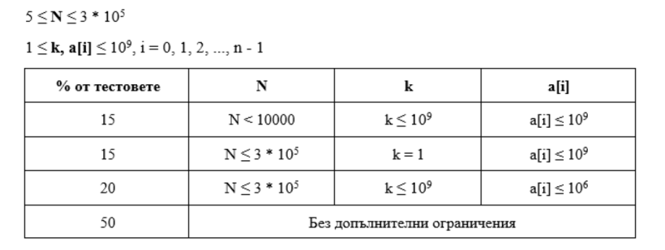

# Task 3. Smaller (Hard)

[HackerRank link](<https://www.hackerrank.com/contests/sda-hw-7/challenges/numbers-13-1>)

## Statement:

Дадени са $N$ цели числа - $a_0,a_1,\dots,a_{n-1}$ и цяло число $k$. За всеки индекс $i$ да се намери индекс $j$, такъв че да са изпълнени следните условия:

- $j \< i$
- $a_j \< a_i$
- $a_i-a_j \le k$
- $j$ е максимално голям

С други думи се иска за всеки индекс $i$ да се намери индексът на първия по-малък елемент наляво от $a_i$, който да не е с повече от $k$ по-малък от $a_i$.

**Input Format**

На първия ред са зададени числата $N$ и $k$. На втория ред, разделени с интервал, са зададени $a_0,a_1,\dots,a_{n-1}$.

**Constraints**



**Output Format**

На един ред, разделени с интервал, да се изведат търсените индекси за всяко $i$.  

**Ако за някое $i$ не съществува индекс, удовлетворяващ условията, да се изведе `-1`.**

---

**Sample Input 0**

```
6 2
1 5 3 6 2 5
```

**Sample Output 0**

```
-1 -1 0 1 0 2
```

---

**Sample Input 1**

```
21 123432
550802294 550826981 550851668 550882527 550868126 550991559 550944244 525557378 551053276 550892813 550888698 550826981 550882527 550868126 827495781 550898985 550933958 551005961 550876355 525598523 550991559
```

**Sample Output 1**

```
-1 0 1 2 2 3 4 -1 6 4 4 0 11 11 -1 13 15 16 13 7 18
```