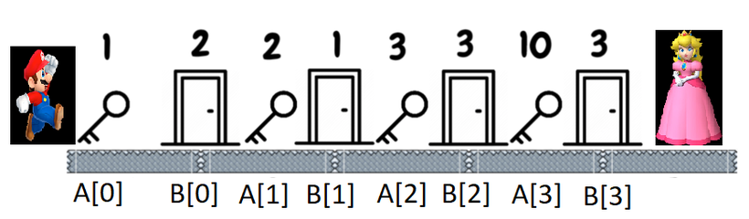

# Task 1. Super mario (Easy)

[HackerRank link](<https://www.hackerrank.com/contests/sda-hw-9-2021/challenges/1-126-1>)

## Statement:

Супер Марио е решен да спаси Princess Peach Toadstool. За целта той трябва да премине праволинеен тунел. В тунела има $N$ на брой врати, като всяка врата се отключва от ключ с определен номер (има врати с еднакви ключалки). Между всеки две врати има ключ (има редуване на ключ и врата). Броят на ключовете и вратите е равен. При влизане в тунела, Супер Марио намира първия си ключ, след него следва врата и така се редуват, докато не стигне до принцесата (края на тунела). По пътя си Супер Марио събира всички ключове и ако няма ключ за дадена врата, я разбива, а ако има ключ, трябва задължително да го използва. Важно е да се отбележи, че ако даден ключ $x$ отключи врата, то този ключ става неизползваем. Търсим броя на разбитите врати по дадени $N$ ключа и $N$ ключалки. Врата с ключалка `4` изисква ключ `4`, за да бъде отключена.

**Input Format**

На първия ред е зададено числото $N$ - броя на ключовете и вратите. На втория ред са дадени $N$ на брой числа (ключове) $A_i$. На третия ред са зададени $B_i$ - номерата на ключовете, които са необходими за отключване на врата $i$.

**Constraints**

$1 \le N \le 5\cdot 10^6$

$1 \le A_i \le 10^9$

$1 \le B_i \le 10^9$

**Output format**

На единствен ред изведете минималния брой врати, които Супер марио трябва да разбие, за да стигне до принцесата.

---

**Sample Input 0**

```
4
1 2 3 10
2 1 3 3
```

**Sample Output 0**

```
2
```

**Explanation 0**



Супер Марио тръгва по тунела и намира ключ с номер 1. За момента това е единствения ключ, с който разполага. Следва врата, която изисква ключ номер 2, но той няма такъв и се налага да я разбие. След това взема ключ 2 и вече разполага с ключове 1, 2. Отключва втората врата с ключ номер 1 и остава само с ключ 2. Взема ключ 3, който му се налага да използва при следващата врата. Взема ключ 10 и вече разполага с ключове 2, 10, но няма необходимия за отключването на последната врата ключ номер 3 и това е втората и последна врата, която му се налага да разбие, преди да стигне до принцесата.

---

**Sample Input 1**

```
5
10 8 1 3 9
3 9 1 2 17
```

**Sample Output 1**

```
4
```