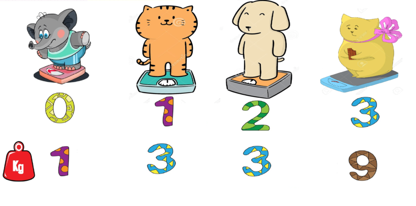

# Task 2. Weighing animals (Medium)

[HackerRank link](<https://www.hackerrank.com/contests/sda-hw-9-2021/challenges/weighing-animals>)

## Statement:

Дадени са килограмите на $N$ на брой различни животни, където всеки индекс $i$ отговаря на различно животно, а $Arr[i]$ са неговите килограми. Даден е и критерий за килограми $K$. Търсим всички тройки животни (индекси), такива, че за животните от намерена тройка `(x, y, z)`  е вярно, че:

- $Arr[y] = K\cdot Arr[x]$
- $Arr[z] = K\cdot Arr[y]$
- $x \< y \< z$

**Input Format**

Първият ред съдържа две числа $N$ и $K$. На следващия ред се въвеждат $N$ на брой числа, разделени с интервал  - килограмите $Arr[i]$ на всяко животно $i$.

**Constraints**

$1 \le N \le 10^5$

$1 \le K \le 10^9$

$1 \le Arr[i] \le 10^9$

**Output Format**

Едно число, което съотвества на броя тройки животни.

---

**Sample Input 0**

```
4 3
1 3 3 9
```

**Sample Output 0**

```
2
```

**Explanation 0**



От дадените животни можем да сформираме 2 тройки. 

Едната е от животни `(0, 1, 3)` с килограми `(1, 3, 9)`, понеже $K = 3$ и $3 = K\cdot 1$, а $9 = K\cdot3$.

Другата е `(0, 2, 3)` с килограми `(1, 3, 9)`.

---

**Sample Input 1**

```
6 2
1 2 4 4 8 16
```

**Sample Output 1**

```
6
```

**Explanation 1**

Можем да сформираме съответните 6 тройки животни: `(0, 1, 2), (0, 1, 3), (1, 2, 4), (1, 3, 4), (2, 4, 5), (3, 4, 5)`

---

**Sample Input 2**

```
5 3
5 3 1 4 2
```

**Sample Output 2**

```
0
```