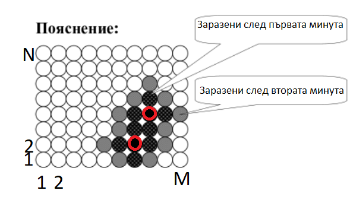

# Task 2. Cinema 2021 (Medium)

[HackerRank link](<https://www.hackerrank.com/contests/sda-hw-10-2021/challenges/cinema-2021>)

## Statement:

В днешно време ходенето на кино крие своите опасности. На 8-ми декември група студенти от СУ се събрали и запълнили един киносалон, който има правоъгълна форма с $N$ реда и $M$ стълба. Филмът, който ще гледат, е с продължителност $T$. Проблемът е, че $K$ на брой от студентите са заразени с Ковид. Най-лошото е, че вирусът се разпространява бързо и след всяка минута от филма човек, който е болен, заразява седналите до него (човекът от ляво на него, от дясно на него, пред него и зад него). Вашата задача е да намерите броя на останалите здрави студенти след края на филма.

**Input Format**

На първия ред са зададени две числа $N$ (редове) и $M$ (стълбове). На втория ред отново са дадени 2 числа $T$ (продължителност на филма в минути) и $K$ (броя на допуснатие в киното болни студенти). Следват K на брой реда, всеки от които съдържа две числа $i$ (ред) и $j$ (колона) - мястото, където стои студент, който е болен от ковид.

**Constraints**

$0\le N \le M\le 1000$

$0\le T\le 100$

$1 \le K\le 2$

$1 \le i, j\le 1000$

**Output Format**

На единствен ред изведете броя на здравите студенти след края на филма.

---

**Sample Input 0**

```
8 10
2 2
4 8
2 7
```

**Sample Output 0**

```
59
```

**Explanation 0**

Киносалонът се състои от 8 реда и 10 колони. Филмът е с продължителност 2 минути. Дадени са двама болни студенти. Единият се намира на ред 4 колона 8, а другият на ред 2 колона 7. Отбелязани са с червени кръгчета. До края на филма има общо 21 болни, а общо в залата има 80 студенти. Остават 80 - 21 = 59 здрави студенти.



---

**Sample Input 1**

```
3 3
1 1
1 2
```

**Sample Output 1**

```
5
```