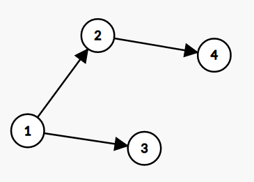
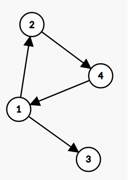

# Task 1. I use arch btw (Medium)

[HackerRank link](<https://www.hackerrank.com/contests/sda-hw-10-2021/challenges/if-you-reading-this-get-baited>)

## Statement:

Най-модерната операционна система xnuᴉ˥ има много диструбиции, като често дистрибуциите копират една от друга. Възможно е една дистрибуция да копира повече от 1 друга дистрибуция, както и много дистрибуции да копират една основна.

Определете дали йерархията е счупена. Йерархията ще е счупена, ако има дистрибуция, която директно или индиректно копира себе си.

За улесниение дистрибуциите ще са именувани с цели числа.

**Input Format**

На първия ред получавате едно число $Q$ - брой заявки.

Следват $Q$ на брой заявки. Всяка заявка е:

- на първия ред едно число $E$ - брой ребра. 
- На следващите $E$ реда има двойки числа `Start End`, начален и краен връх на ребро (`End` е дистрибуция, която копира `Start`)

**Constraints**

$0 \le Q \le 40$

$0 \le E \le 10^6$

$0 \le Start, End \le 10^8$

Като тънка подсказка: ограниченията не изискват оптимален алгоритъм :)

**Output format**

На един ред изведете резултатите за всички заявки, разделени с интервал.

Резултат може да е  `1`,  ако йерархията е счупена, или  `0`,  ако е валидна.

---

**Sample Input 0**

```
2
3
1 2
1 3
2 4
4
1 2
1 3
2 4
4 1
```

**Sample Output 0**

```
0 1
```

**Explanation 0**

Първата йерархия има следния вид:



Тя е валидна, защото няма дистрибуция, която да копира себе си директно или индиректно.

Втората йерархия има следния вид:



Тя не е валидна, защото дистрибуцията 2 копира 1, 4 копира 2 и 1 копира 4.