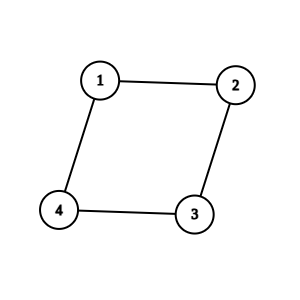
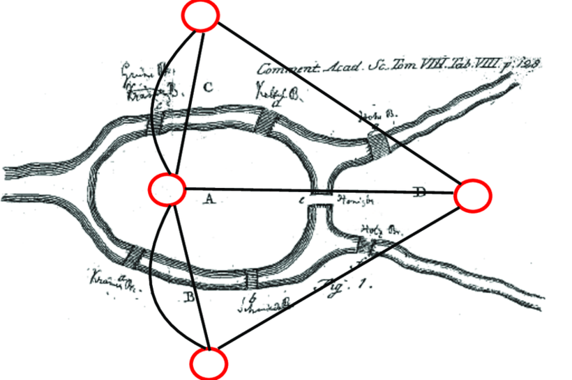

# Task 3. The Islander (Medium)

[HackerRank link](<https://www.hackerrank.com/contests/sda-hw-13-2022/challenges/islander>)

## Statement:

Известният математик Ойлер искал да мине през всички мостове на Кьонигсберг, без да минава през някой мост 2 или повече пъти. От там се ражда и известният проблем за Ойлеров цикъл и Ойлеров път, като това са обхождания на граф по такъв начин, че всяко ребро се посещава точно по веднъж.

Вашата задача е по подаден граф да определите дали Ойлер може да обходи всяко ребро в графа точно по веднъж и ако да - дали накрая ще се върне във върха, от където е тръгнал, или не.

**Забележка:** Ойлер трябва да може да посети всички върхове на графа, не е достатъчно подграф да съдържа Ойлеров цикъл/път.

**Input Format**

Нап първият ред ще получите 1 число $Q$ - броя на заявките, които ще получите.

След това $Q$ пъти ще получите:

На първи ред двойка числа $N$ и $M$, съответно броя на върховете и броя на ребрата в даден граф.

На следващите $M$ реда ще получите по 2 числа $a$ и $b$, които дефинират ребро между върха $a$ и върха $b$ за графа, описан на горния ред.

**Constraints**

$1\le Q\le 100$

$1\le N, M \le 10^5$

$1\le a,b\le 10^5$

Не е задължително върховете на графа да са индексирани с числата $[0, N-1]$.

**Output Format**

За всяка една заявка изведете едно от следните 3 на нов ред:

-   `none`, ако графът не е нито Ойлеров път, нито Ойлеров цикъл
-   `epath`, ако графът има Ойлеров път
-   `ecycle`, ако графът има Ойлеров цикъл

Ойлеров цикъл е по-силен от Ойлеров път. т.е ако има цикъл е гарантирано, че има и път, но изведете, че има цикъл, тъй като това дава повече информация.

---

**Sample Input 0**

```
2
4 4
1 2
3 2
4 3
1 4
4 7
1 2
1 2
1 4
2 4
2 3
2 3
3 4
```

**Sample Output 0**

```
ecycle
none
```

**Explanation 0**

Имаме 2 графа, които трябва да определим дали имат Ойлеров път/цикъл.



Първият граф има ойлеров цикъл, защото може да посетим всички ребра по един път и да приключим обхождането в същия връх, от който сме тръгнали.



Вторият граф е класическия пример за седемте моста на Кьонигсберг, който за жалост не е нито Ойлеров цикъл, нито Ойлеров път.