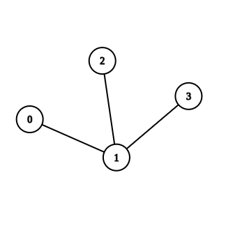
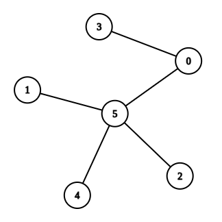

# Task 2. Минимална дълбочина (Medium)

[HackerRank link](<https://www.hackerrank.com/contests/sda-hw-13-2022/challenges/challenge-2806>)

## Statement:

Времето за търсене на възел в дърво зависи от дълбочината му. Затова е добре да минимизираме дълбочината на дърветата, с които работим. Имплементирайте алгоритъм, който да намира оптималния връх/върхове в дадено дърво, така че да се минимизира дълбочината на дървото.

Дървото, което ще получите, няма фиксиран брой деца и не е дърво за търсене. Единствено се изисква да намерите върха/върховете, който ако бъде избран за корен, ще минимизира дълбочината на цялото дърво.

**Input Format**

На първият ред ще получите $N$ - броя на върховете в дървото.

На следващите $N-1$ реда ще получите по една двойка числа $a$ $b$, които обозначават, че връх  $a$ е свързан с връх $b$. Може да си мислите, че това са ребра в ненасочен граф, тъй като не ни интересува дали $a$ е родител или дете на $b$ накрая.

**Constraints**

$0\le N\le 10^6$

$0\le a\< N$

$0\le b\< N$

**Output Format**

На един ред изведете всички върхове, които ако станат корен, ще минимизират дълбочината на дървото. Върховете да са подредени в нарастващ ред.

---

**Sample Input 0**

```
4
0 1
1 2
1 3
```

**Sample Output 0**

```
1 
```

**Explanation 0**



Дървото има само 1 връх, който ще минимизра дълбочината на цялото дърво -  `1`. Ако изберем някой от другите върхове за корен ще получим дърво с дълбочина 2.

---

**Sample Input 1**

```
6
1 5
3 0
4 5
0 5
5 2
```

**Sample Output 1**

```
0 5 
```

**Explanation 1**



Дървото, което се получава има 2 върха, които може да изберем за корен, така че да минимизираме дълбочината на цялото дърво - именно 0 и 5. Извеждаме ги като  `0 5`, а не  `5 0`, защото 0 < 5.